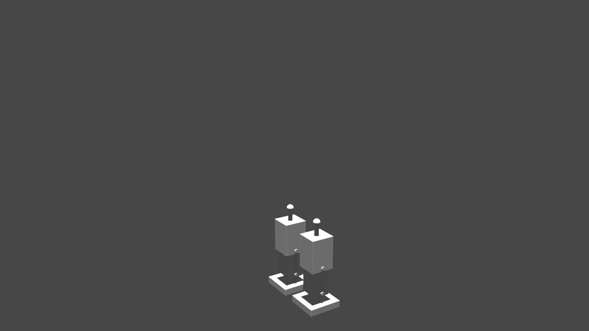

# proyecto-modelado3d-Amglega

## Objective

The model created in this script tries to mimic the apperance and functionality of a classic robot design

## Legs

The first part to create will be the legs.

Both of the legs are composed of three structural parts, the foot, the leg part itself, and the thigh (in blue tones). And two axes that provides mobility (painted in black).
