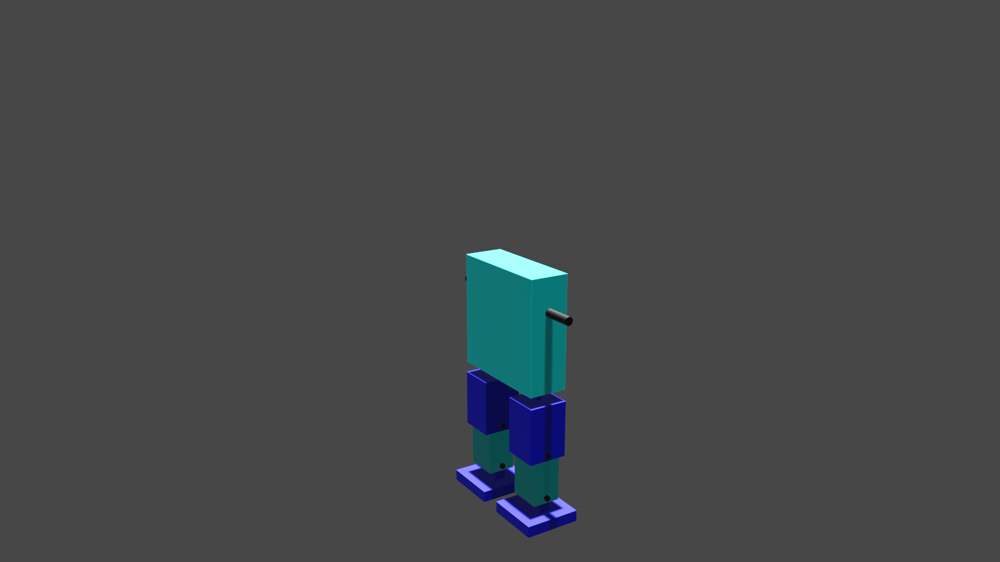

# proyecto-modelado3d-Amglega

## Objective

The model created in this script tries to mimic the apperance and functionality of a classic robot design

## Legs

The first part to create will be the legs.

Both of the legs are composed of three structural parts, the foot, the leg part itself, and the thigh (in blue tones). And two axes that provides mobility (painted in black).

## Body

The next one is the body.

Similarly to the legs the main rigid part is painted in blue and the mobile ones in black. 
This part was easier than the last one not only because most of the used functions were already made but also because it is only made of one piece.
